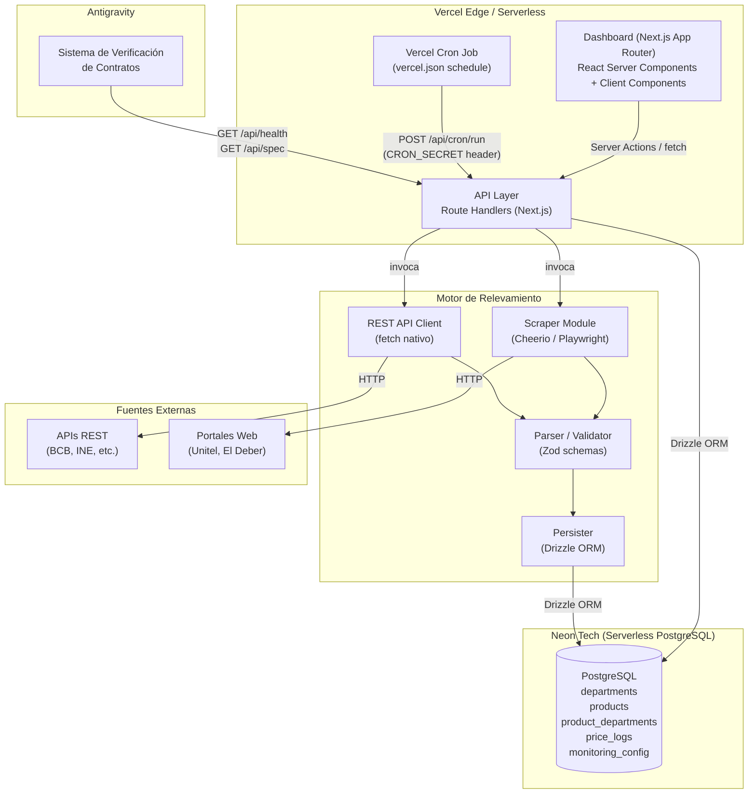
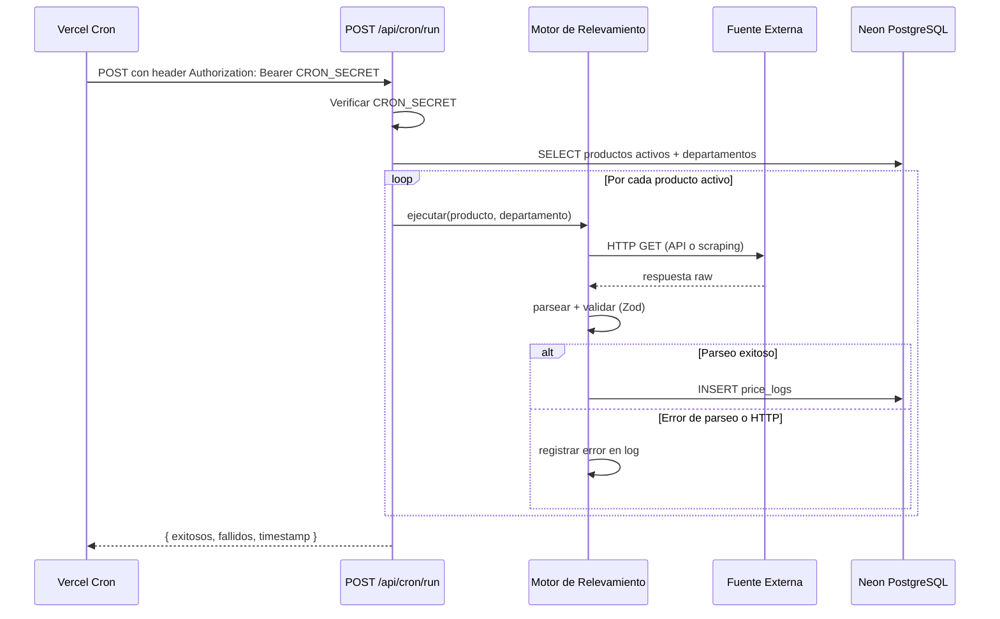
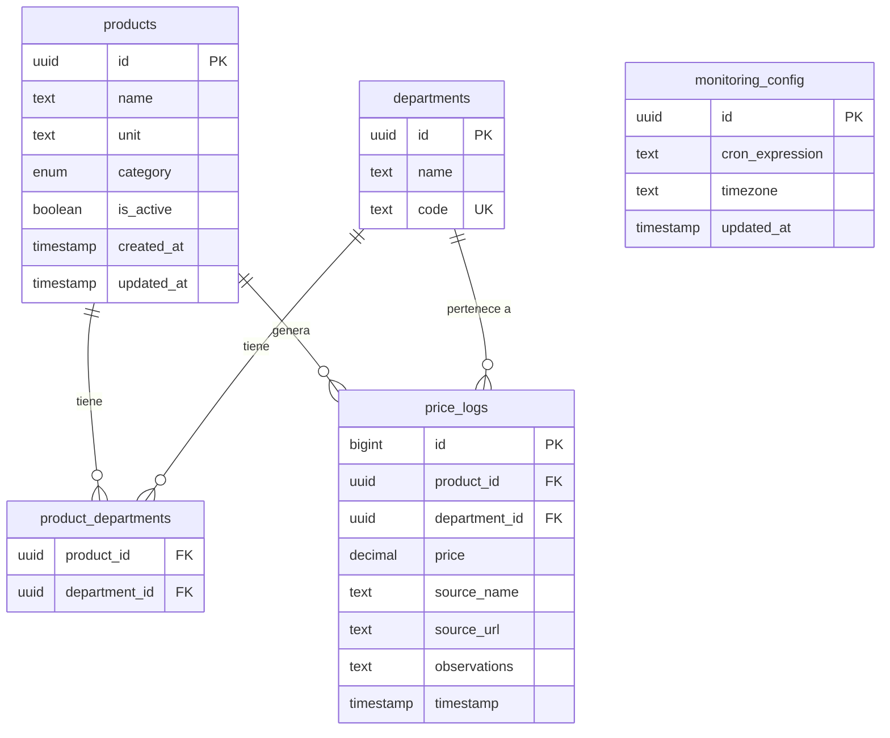

# Documento de Diseño Técnico: Monitor de Precios SCZ

## Descripción General

El **Monitor de Precios SCZ** es una aplicación web full-stack construida sobre Next.js (App Router) que automatiza el relevamiento, almacenamiento y visualización de precios de la canasta básica, divisas y datos demográficos en Bolivia con soporte multi-departamento.

El sistema opera en tres capas principales:

1. **Capa de Presentación**: Dashboard React (App Router) con Tailwind CSS + Shadcn UI para gestión de productos, configuración y visualización de tendencias.
2. **Capa de API**: Route Handlers de Next.js que exponen endpoints REST para CRUD de productos, disparo del motor de relevamiento, configuración y contratos de datos.
3. **Capa de Datos**: PostgreSQL serverless en Neon Tech, accedido mediante Drizzle ORM, con cinco tablas principales.

La automatización se implementa mediante Vercel Cron Jobs que invocan el endpoint del Motor de Relevamiento en intervalos configurables.

---

## Arquitectura

### Diagrama de Componentes



### Flujo de Datos Principal



---

## Componentes e Interfaces

### Estructura de Directorios

```
src/
├── app/
│   ├── (dashboard)/
│   │   ├── page.tsx                    # Dashboard principal (resumen)
│   │   ├── productos/
│   │   │   ├── page.tsx                # Lista de productos
│   │   │   └── [id]/page.tsx           # Detalle / edición de producto
│   │   ├── tendencias/
│   │   │   └── page.tsx                # Gráficos de tendencia
│   │   └── configuracion/
│   │       └── page.tsx                # Configuración de monitoreo
│   └── api/
│       ├── health/route.ts             # GET /api/health
│       ├── spec/route.ts               # GET /api/spec
│       ├── cron/
│       │   └── run/route.ts            # POST /api/cron/run
│       ├── products/
│       │   ├── route.ts                # GET, POST /api/products
│       │   └── [id]/route.ts           # GET, PUT, PATCH /api/products/:id
│       ├── price-logs/
│       │   └── route.ts                # GET /api/price-logs
│       └── monitoring-config/
│           └── route.ts                # GET, PUT /api/monitoring-config
├── components/
│   ├── ui/                             # Shadcn UI primitivos
│   ├── products/
│   │   ├── ProductTable.tsx
│   │   ├── ProductForm.tsx
│   │   └── ProductFilters.tsx
│   ├── charts/
│   │   ├── PriceTrendChart.tsx
│   │   └── PriceSummaryCard.tsx
│   └── config/
│       └── MonitoringConfigForm.tsx
├── lib/
│   ├── db/
│   │   ├── schema.ts                   # Drizzle schema
│   │   └── index.ts                    # Conexión Neon + Drizzle
│   ├── engine/
│   │   ├── index.ts                    # Orquestador del motor
│   │   ├── scrapers/
│   │   │   ├── base.ts                 # Interfaz base del scraper
│   │   │   ├── unitel.ts
│   │   │   └── eldeber.ts
│   │   ├── clients/
│   │   │   ├── base.ts                 # Interfaz base del cliente REST
│   │   │   └── bcb.ts                  # Banco Central de Bolivia
│   │   └── parser.ts                   # Zod schemas + parse/serialize
│   ├── validations/
│   │   └── schemas.ts                  # Zod schemas para API inputs
│   └── utils/
│       └── cron.ts                     # Validación de expresiones cron
```

### Interfaces TypeScript Clave

```typescript
// Resultado de una ejecución del motor
interface EngineRunResult {
  successful: number;
  failed: number;
  errors: EngineError[];
  finishedAt: string; // ISO8601 America/La_Paz
}

interface EngineError {
  productId: string;
  departmentId: string;
  source: string;
  reason: string;
  timestamp: string;
}

// Registro de precio parseado (antes de persistir)
interface PriceRecord {
  productId: string;
  departmentId: string;
  price: number;
  sourceName: string;
  sourceUrl: string;
  observations?: string;
  timestamp: string; // ISO8601 America/La_Paz
}

// Interfaz base para scrapers
interface ScraperAdapter {
  sourceName: string;
  sourceUrl: string;
  fetch(productCode: string, departmentCode: string): Promise<PriceRecord>;
}

// Interfaz base para clientes REST
interface RestApiAdapter {
  sourceName: string;
  sourceUrl: string;
  fetch(productCode: string, departmentCode: string): Promise<PriceRecord>;
}
```

---

## Modelo de Datos

### Esquema Drizzle ORM

```typescript
// lib/db/schema.ts
import { pgTable, uuid, text, boolean, decimal, bigserial, timestamp, pgEnum, unique } from 'drizzle-orm/pg-core';

export const categoryEnum = pgEnum('category', ['Alimentos', 'Divisas', 'Demografía']);

export const departments = pgTable('departments', {
  id:   uuid('id').primaryKey().defaultRandom(),
  name: text('name').notNull(),
  code: text('code').notNull().unique(),
});

export const products = pgTable('products', {
  id:        uuid('id').primaryKey().defaultRandom(),
  name:      text('name').notNull(),
  unit:      text('unit').notNull(),
  category:  categoryEnum('category').notNull(),
  isActive:  boolean('is_active').notNull().default(true),
  createdAt: timestamp('created_at', { withTimezone: true }).notNull().defaultNow(),
  updatedAt: timestamp('updated_at', { withTimezone: true }).notNull().defaultNow(),
});

export const productDepartments = pgTable('product_departments', {
  productId:    uuid('product_id').notNull().references(() => products.id, { onDelete: 'cascade' }),
  departmentId: uuid('department_id').notNull().references(() => departments.id, { onDelete: 'restrict' }),
}, (t) => ({
  pk: unique().on(t.productId, t.departmentId),
}));

export const priceLogs = pgTable('price_logs', {
  id:           bigserial('id', { mode: 'number' }).primaryKey(),
  productId:    uuid('product_id').notNull().references(() => products.id),
  departmentId: uuid('department_id').notNull().references(() => departments.id),
  price:        decimal('price', { precision: 18, scale: 4 }).notNull(),
  sourceName:   text('source_name').notNull(),
  sourceUrl:    text('source_url').notNull(),
  observations: text('observations'),
  timestamp:    timestamp('timestamp', { withTimezone: true }).notNull().defaultNow(),
});

export const monitoringConfig = pgTable('monitoring_config', {
  id:             uuid('id').primaryKey().defaultRandom(),
  cronExpression: text('cron_expression').notNull().default('0 8 * * *'),
  timezone:       text('timezone').notNull().default('America/La_Paz'),
  updatedAt:      timestamp('updated_at', { withTimezone: true }).notNull().defaultNow(),
});
```

### Diagrama Entidad-Relación



### Datos Semilla: Departamentos

```sql
INSERT INTO departments (id, name, code) VALUES
  (gen_random_uuid(), 'Santa Cruz',  'SCZ'),
  (gen_random_uuid(), 'La Paz',      'LPZ'),
  (gen_random_uuid(), 'Cochabamba',  'CBB'),
  (gen_random_uuid(), 'Oruro',       'ORU'),
  (gen_random_uuid(), 'Potosí',      'POT'),
  (gen_random_uuid(), 'Chuquisaca',  'CHU'),
  (gen_random_uuid(), 'Tarija',      'TJA'),
  (gen_random_uuid(), 'Beni',        'BEN'),
  (gen_random_uuid(), 'Pando',       'PAN');
```

---

## Diseño de la API

### Contratos de Endpoints

#### `GET /api/health`

Verifica conectividad con la base de datos.

**Respuesta 200:**
```json
{ "status": "ok", "db": "connected", "timestamp": "2025-01-15T10:30:00-04:00" }
```

**Respuesta 503:**
```json
{ "status": "error", "db": "disconnected", "timestamp": "2025-01-15T10:30:00-04:00" }
```

---

#### `GET /api/spec`

Retorna el esquema de contratos de datos para Antigravity.

**Respuesta 200:**
```json
{
  "version": "1.0.0",
  "models": {
    "Product": {
      "id": "uuid",
      "name": "string",
      "unit": "string",
      "category": "Alimentos | Divisas | Demografía",
      "isActive": "boolean"
    },
    "PriceLog": {
      "id": "bigint",
      "productId": "uuid",
      "departmentId": "uuid",
      "price": "decimal",
      "sourceName": "string",
      "sourceUrl": "string",
      "observations": "string | null",
      "timestamp": "ISO8601"
    },
    "Department": {
      "id": "uuid",
      "name": "string",
      "code": "string"
    },
    "MonitoringConfig": {
      "id": "uuid",
      "cronExpression": "string",
      "timezone": "string"
    }
  }
}
```

---

#### `GET /api/products`

Lista productos con filtros opcionales.

**Query params:** `category?: string`, `departmentId?: string`, `isActive?: boolean`

**Respuesta 200:**
```json
[
  {
    "id": "uuid",
    "name": "Carne de Pollo",
    "unit": "kg",
    "category": "Alimentos",
    "isActive": true,
    "departments": [{ "id": "uuid", "name": "Santa Cruz", "code": "SCZ" }]
  }
]
```

---

#### `POST /api/products`

Crea un nuevo producto.

**Body:**
```json
{
  "name": "Carne de Pollo",
  "unit": "kg",
  "category": "Alimentos",
  "departmentIds": ["uuid-scz", "uuid-lpz"]
}
```

**Respuesta 201:** Objeto producto creado.
**Respuesta 400:** `{ "error": "Mensaje descriptivo" }` si validación falla.

---

#### `PUT /api/products/:id`

Actualiza un producto existente (reemplaza campos enviados).

**Body:** Misma estructura que POST (todos los campos opcionales).
**Respuesta 200:** Objeto producto actualizado.
**Respuesta 404:** `{ "error": "Producto no encontrado" }`

---

#### `PATCH /api/products/:id`

Actualiza parcialmente un producto (ej. solo `isActive`).

**Body:** `{ "isActive": false }`
**Respuesta 200:** Objeto producto actualizado.

---

#### `GET /api/price-logs`

Consulta registros de precios con filtros.

**Query params:** `productId`, `departmentId`, `from` (ISO8601), `to` (ISO8601), `limit` (default 100)

**Respuesta 200:**
```json
[
  {
    "id": 1,
    "productId": "uuid",
    "departmentId": "uuid",
    "price": "12.50",
    "sourceName": "Unitel",
    "sourceUrl": "https://...",
    "observations": null,
    "timestamp": "2025-01-15T08:00:00-04:00"
  }
]
```

---

#### `GET /api/monitoring-config`

Retorna la configuración actual de monitoreo.

**Respuesta 200:**
```json
{ "id": "uuid", "cronExpression": "0 8 * * *", "timezone": "America/La_Paz" }
```

---

#### `PUT /api/monitoring-config`

Actualiza la configuración de monitoreo.

**Body:** `{ "cronExpression": "0 8 * * 1" }`
**Respuesta 200:** Configuración actualizada.
**Respuesta 400:** `{ "error": "Expresión cron inválida" }` si el formato es incorrecto.

---

#### `POST /api/cron/run`

Dispara el Motor de Relevamiento. Protegido por `CRON_SECRET`.

**Headers:** `Authorization: Bearer <CRON_SECRET>`
**Query params opcionales:** `category?: string`, `departmentCode?: string`

**Respuesta 200:**
```json
{ "successful": 12, "failed": 1, "errors": [...], "finishedAt": "2025-01-15T08:05:00-04:00" }
```

**Respuesta 401:** `{ "error": "No autorizado" }` si el token es inválido o ausente.

---

## Motor de Relevamiento

### Arquitectura del Motor

El motor es un módulo TypeScript puro (`lib/engine/index.ts`) invocado desde el Route Handler `POST /api/cron/run`. Opera de forma secuencial sobre los productos activos para evitar sobrecarga en el entorno serverless de Vercel.

```typescript
// lib/engine/index.ts
export async function runEngine(options?: {
  category?: string;
  departmentCode?: string;
}): Promise<EngineRunResult> {
  // 1. Obtener productos activos con sus departamentos
  const products = await getActiveProducts(options);
  
  const result: EngineRunResult = { successful: 0, failed: 0, errors: [], finishedAt: '' };

  for (const product of products) {
    for (const department of product.departments) {
      try {
        const adapter = resolveAdapter(product, department);
        const record = await adapter.fetch(product.code, department.code);
        const validated = PriceRecordSchema.parse(record); // Zod
        await persistPriceRecord(validated);
        result.successful++;
      } catch (err) {
        result.failed++;
        result.errors.push(buildError(product, department, err));
      }
    }
  }

  result.finishedAt = new Date().toLocaleString('sv-SE', { timeZone: 'America/La_Paz' });
  return result;
}
```

### Resolución de Adaptadores

Cada producto tiene un campo `sourceType` (`api` | `scraper`) y un `sourceKey` que mapea al adaptador correspondiente:

```typescript
const ADAPTER_REGISTRY: Record<string, ScraperAdapter | RestApiAdapter> = {
  'bcb-usd':    new BcbApiClient(),
  'unitel-web': new UnitelScraper(),
  'eldeber-web': new ElDeberScraper(),
};

function resolveAdapter(product: Product, department: Department) {
  const key = `${product.sourceKey}-${product.sourceType}`;
  const adapter = ADAPTER_REGISTRY[product.sourceKey];
  if (!adapter) throw new Error(`Adaptador no encontrado: ${product.sourceKey}`);
  return adapter;
}
```

### Parser y Validación Zod

```typescript
// lib/engine/parser.ts
import { z } from 'zod';

export const PriceRecordSchema = z.object({
  productId:    z.string().uuid(),
  departmentId: z.string().uuid(),
  price:        z.number().positive(),
  sourceName:   z.string().min(1),
  sourceUrl:    z.string().url(),
  observations: z.string().optional(),
  timestamp:    z.string().datetime({ offset: true }),
});

export type PriceRecord = z.infer<typeof PriceRecordSchema>;

// Serialización a formato DB
export function serializePriceRecord(record: PriceRecord) {
  return {
    productId:    record.productId,
    departmentId: record.departmentId,
    price:        record.price.toString(),
    sourceName:   record.sourceName,
    sourceUrl:    record.sourceUrl,
    observations: record.observations ?? null,
    timestamp:    new Date(record.timestamp),
  };
}

// Deserialización desde DB
export function deserializePriceLog(row: typeof priceLogs.$inferSelect): PriceRecord {
  return PriceRecordSchema.parse({
    productId:    row.productId,
    departmentId: row.departmentId,
    price:        parseFloat(row.price),
    sourceName:   row.sourceName,
    sourceUrl:    row.sourceUrl,
    observations: row.observations ?? undefined,
    timestamp:    row.timestamp.toISOString(),
  });
}
```

---

## Diseño del Dashboard

### Componentes UI Principales

#### 1. Página de Productos (`/productos`)

- **`ProductTable`**: Tabla con columnas Nombre, Unidad, Categoría, Departamentos, Estado. Acciones: Editar, Activar/Desactivar.
- **`ProductFilters`**: Selectores de Categoría y Departamento para filtrar la tabla.
- **`ProductForm`**: Formulario modal (Shadcn Dialog) para crear/editar productos. Incluye multi-select de departamentos.

#### 2. Página de Tendencias (`/tendencias`)

- **`PriceTrendChart`**: Gráfico de líneas (Recharts) con:
  - Eje X: tiempo (fecha/hora)
  - Eje Y: precio
  - Una serie por departamento seleccionado
  - Selector de rango de fechas (DateRangePicker de Shadcn)
  - Selector multi-departamento
- **`PriceSummaryCard`**: Tarjeta por producto con último precio, variación porcentual respecto al registro anterior y fuente del dato.

#### 3. Página de Configuración (`/configuracion`)

- **`MonitoringConfigForm`**: Formulario con:
  - Selector de frecuencia predefinida (Diaria, Semanal, Mensual)
  - Input de expresión cron personalizada con validación en tiempo real
  - Botón "Ejecutar ahora" que invoca `POST /api/cron/run` manualmente

#### 4. Dashboard Principal (`/`)

- Resumen de últimos precios por categoría
- Estado del último cron job (exitosos/fallidos)
- Acceso rápido a tendencias y configuración

### Estrategia de Renderizado

| Componente | Estrategia | Justificación |
|---|---|---|
| `ProductTable` | Server Component + `revalidatePath` | Datos estables, no requieren tiempo real |
| `PriceTrendChart` | Client Component | Interactividad (filtros, zoom) |
| `PriceSummaryCard` | Server Component | Datos leídos en servidor |
| `MonitoringConfigForm` | Client Component | Formulario interactivo |

---

## Configuración de Seguridad

### Headers HTTP (`next.config.js`)

```javascript
// next.config.js
const securityHeaders = [
  { key: 'Content-Security-Policy',   value: "default-src 'self'; script-src 'self' 'unsafe-inline'; style-src 'self' 'unsafe-inline'" },
  { key: 'X-Frame-Options',           value: 'DENY' },
  { key: 'X-Content-Type-Options',    value: 'nosniff' },
  { key: 'Referrer-Policy',           value: 'strict-origin-when-cross-origin' },
];

module.exports = {
  async headers() {
    return [{ source: '/(.*)', headers: securityHeaders }];
  },
};
```

### Rate Limiting

Se implementa mediante middleware de Next.js usando un contador en memoria (o Upstash Redis para producción multi-instancia):

| Endpoint | Límite |
|---|---|
| `GET /api/health` | 60 req/min |
| `GET /api/spec` | 60 req/min |
| `GET /api/products` | 30 req/min |
| `POST /api/products` | 10 req/min |
| `GET /api/price-logs` | 30 req/min |
| `POST /api/cron/run` | 5 req/min (más restrictivo) |

### Autenticación del Cron Job

```typescript
// app/api/cron/run/route.ts
export async function POST(request: Request) {
  const authHeader = request.headers.get('authorization');
  const token = authHeader?.replace('Bearer ', '');
  
  if (!token || token !== process.env.CRON_SECRET) {
    return Response.json({ error: 'No autorizado' }, { status: 401 });
  }
  
  // ... ejecutar motor
}
```

### Variables de Entorno Requeridas

```env
# Base de datos
DATABASE_URL=postgresql://...@neon.tech/...

# Seguridad
CRON_SECRET=<token-aleatorio-256-bits>

# Opcional: Rate limiting distribuido
UPSTASH_REDIS_REST_URL=...
UPSTASH_REDIS_REST_TOKEN=...
```

---

## Estrategia de Despliegue: Vercel + Neon

### Configuración de Vercel Cron Jobs

```json
// vercel.json
{
  "crons": [
    {
      "path": "/api/cron/run",
      "schedule": "0 8 * * *"
    }
  ]
}
```

> **Nota:** La expresión cron en `vercel.json` se actualiza en cada despliegue. Cuando el administrador cambia la frecuencia en el panel, el sistema actualiza `monitoring_config` en la base de datos y genera un nuevo `vercel.json` que se aplica en el siguiente deploy.

### Configuración de Neon Tech

- **Pooling**: Usar `@neondatabase/serverless` con connection pooling para entornos serverless.
- **Migraciones**: Drizzle Kit (`drizzle-kit push` en desarrollo, `drizzle-kit migrate` en CI/CD).
- **Branching**: Usar Neon database branches para entornos de staging/preview.

```typescript
// lib/db/index.ts
import { neon } from '@neondatabase/serverless';
import { drizzle } from 'drizzle-orm/neon-http';
import * as schema from './schema';

const sql = neon(process.env.DATABASE_URL!);
export const db = drizzle(sql, { schema });
```

### Pipeline de CI/CD

```
Push a main
  → Vercel Build
  → drizzle-kit migrate (script de build)
  → Deploy a producción
  → Vercel aplica nuevo vercel.json (cron schedule)
```

---

## Manejo de Errores

### Principios

1. **Errores de validación (400)**: Mensajes descriptivos con el campo y la razón del fallo.
2. **Errores de autenticación (401)**: Mensaje genérico "No autorizado" sin detalles.
3. **Errores de negocio (404, 409)**: Mensajes descriptivos del recurso afectado.
4. **Errores internos (500)**: En producción, solo "Error interno del servidor". En desarrollo, stack trace completo.
5. **Errores del motor**: Capturados por producto/departamento, no interrumpen la ejecución completa.

### Wrapper de Error para API

```typescript
// lib/utils/api-error.ts
export function handleApiError(error: unknown, isDev = false) {
  if (error instanceof z.ZodError) {
    return Response.json(
      { error: error.errors.map(e => `${e.path.join('.')}: ${e.message}`).join(', ') },
      { status: 400 }
    );
  }
  console.error(error);
  return Response.json(
    { error: isDev ? String(error) : 'Error interno del servidor' },
    { status: 500 }
  );
}
```

---

## Propiedades de Corrección


*Una propiedad es una característica o comportamiento que debe mantenerse verdadero en todas las ejecuciones válidas del sistema — esencialmente, una declaración formal sobre lo que el sistema debe hacer. Las propiedades sirven como puente entre las especificaciones legibles por humanos y las garantías de corrección verificables por máquinas.*

### Propiedad 1: Creación de producto válido persiste correctamente

*Para cualquier* combinación válida de nombre (no vacío), unidad (no vacía) y categoría (Alimentos | Divisas | Demografía), crear un producto debe resultar en un registro persistido en la base de datos con `is_active = true` y todos los campos correctamente almacenados.

**Valida: Requisitos 1.2**

---

### Propiedad 2: Inputs inválidos son rechazados con HTTP 400

*Para cualquier* solicitud a un endpoint de la API que contenga datos que no cumplen el esquema esperado (nombre vacío, categoría fuera del enum, expresión cron malformada, campos requeridos ausentes), el sistema debe rechazar la solicitud con código HTTP 400 y un mensaje de error descriptivo, sin persistir datos parciales.

**Valida: Requisitos 1.3, 4.3, 9.2, 9.3**

---

### Propiedad 3: Edición de producto actualiza todos los campos enviados

*Para cualquier* producto existente y cualquier combinación válida de campos editables (nombre, unidad, categoría, departamentos, isActive), editar el producto debe resultar en que todos los campos enviados se reflejen correctamente en la base de datos.

**Valida: Requisitos 1.4**

---

### Propiedad 4: Desactivación de producto establece is_active = false

*Para cualquier* producto con `is_active = true`, ejecutar la operación de desactivación debe resultar en `is_active = false`, y el Motor de Relevamiento no debe incluir ese producto en ejecuciones posteriores.

**Valida: Requisitos 1.5**

---

### Propiedad 5: Filtrado respeta el criterio aplicado

*Para cualquier* filtro de categoría o departamento aplicado a la lista de productos o a los registros de precios, todos los elementos retornados deben cumplir el criterio del filtro (ningún elemento fuera del filtro debe aparecer en los resultados).

**Valida: Requisitos 1.6, 2.5, 3.5**

---

### Propiedad 6: Asociación producto-departamento persiste correctamente

*Para cualquier* producto y cualquier subconjunto no vacío de departamentos válidos, asociar el producto a esos departamentos debe resultar en que `product_departments` contenga exactamente las filas correspondientes a esas asociaciones.

**Valida: Requisitos 2.2**

---

### Propiedad 7: Todo price_log tiene department_id válido

*Para cualquier* registro de precio persistido por el Motor de Relevamiento, el campo `department_id` debe ser no nulo y debe referenciar un departamento existente en la tabla `departments`. Intentar persistir un registro sin `department_id` debe ser rechazado con error.

**Valida: Requisitos 2.3, 2.4**

---

### Propiedad 8: Motor procesa todos los productos activos

*Para cualquier* conjunto de N productos activos con sus departamentos asociados, una ejecución completa del Motor de Relevamiento debe intentar el relevamiento de exactamente N × (cantidad de departamentos por producto) combinaciones producto-departamento.

**Valida: Requisitos 3.1**

---

### Propiedad 9: Registros persistidos contienen todos los campos requeridos

*Para cualquier* precio válido obtenido de una fuente externa, el registro persistido en `price_logs` debe contener precio, `source_name`, `source_url`, `department_id` y `timestamp` con zona horaria `America/La_Paz`, sin campos nulos en los campos requeridos.

**Valida: Requisitos 3.3**

---

### Propiedad 10: Motor continúa ante errores parciales

*Para cualquier* ejecución del Motor de Relevamiento donde K de N fuentes fallan (error HTTP o scraping), el motor debe completar los N-K relevamientos restantes exitosamente, registrar exactamente K errores con fuente, departamento y timestamp, y retornar un resultado con `failed = K` y `successful = N-K`.

**Valida: Requisitos 3.4, 3.6**

---

### Propiedad 11: Filtrado temporal de price_logs respeta el rango de fechas

*Para cualquier* rango de fechas [from, to] aplicado a la consulta de registros de precios, todos los registros retornados deben tener `timestamp` dentro del rango [from, to] inclusive, y ningún registro fuera del rango debe aparecer en los resultados.

**Valida: Requisitos 5.2**

---

### Propiedad 12: Cálculo de variación porcentual es correcto

*Para cualquier* secuencia de dos o más registros de precio para el mismo producto y departamento, la variación porcentual calculada debe ser igual a `(último_precio - precio_anterior) / precio_anterior × 100`, con precisión de al menos 2 decimales.

**Valida: Requisitos 5.4**

---

### Propiedad 13: Integridad referencial de departamentos

*Para cualquier* departamento que tenga al menos un registro en `price_logs` asociado, intentar eliminar ese departamento debe ser rechazado con un error descriptivo, preservando la integridad de los datos históricos.

**Valida: Requisitos 6.6**

---

### Propiedad 14: Round-trip de PriceRecord preserva todos los campos

*Para cualquier* objeto `PriceRecord` válido, la secuencia parsear → serializar → deserializar debe producir un objeto equivalente al original, con todos los campos (productId, departmentId, price, sourceName, sourceUrl, observations, timestamp) preservados sin pérdida ni alteración.

**Valida: Requisitos 8.3, 8.4, 8.5**

---

### Propiedad 15: Parseo de respuesta válida produce PriceRecord completo

*Para cualquier* respuesta JSON de una fuente externa que contenga los campos requeridos (`price`, `source_name`, `timestamp`) con valores válidos, el parser debe producir un objeto `PriceRecord` tipado con todos los campos correctamente mapeados.

**Valida: Requisitos 8.1**

---

### Propiedad 16: Parseo de respuesta inválida falla sin persistir datos

*Para cualquier* respuesta JSON que carezca de al menos uno de los campos requeridos (`price`, `source_name`, `timestamp`) o que contenga valores de tipo incorrecto, el parser debe retornar un error de parseo descriptivo sin persistir ningún dato parcial en la base de datos.

**Valida: Requisitos 8.2**

---

### Propiedad 17: Autenticación CRON_SECRET protege el endpoint del motor

*Para cualquier* solicitud al endpoint `POST /api/cron/run`, el sistema debe verificar el token `CRON_SECRET` en el header de autorización: solicitudes con token válido deben ejecutar el motor, y solicitudes con token ausente o inválido deben ser rechazadas con HTTP 401 sin ejecutar el motor.

**Valida: Requisitos 9.7, 9.8**

---

### Propiedad 18: Errores en producción no exponen detalles internos

*Para cualquier* error interno del sistema (excepción no controlada, fallo de base de datos, error de parseo) en entorno de producción, la respuesta HTTP debe contener únicamente un mensaje genérico sin stack traces, nombres de archivos, queries SQL ni detalles de implementación interna.

**Valida: Requisitos 9.6**

---

## Estrategia de Testing

### Enfoque Dual

El sistema utiliza dos tipos complementarios de tests:

- **Tests de ejemplo (unit/integration)**: Verifican comportamientos específicos con datos concretos, puntos de integración entre componentes, y casos de borde.
- **Tests de propiedad (property-based)**: Verifican propiedades universales sobre rangos amplios de inputs generados aleatoriamente.

### Librería de Property-Based Testing

Se utilizará **[fast-check](https://fast-check.dev/)** para TypeScript, compatible con Jest/Vitest.

```bash
npm install --save-dev fast-check
```

### Configuración de Tests de Propiedad

Cada test de propiedad debe ejecutarse con un mínimo de **100 iteraciones**:

```typescript
import fc from 'fast-check';

// Ejemplo: Propiedad 14 - Round-trip de PriceRecord
test('Feature: monitor-precios-scz, Property 14: round-trip de PriceRecord preserva todos los campos', () => {
  fc.assert(
    fc.property(arbitraryPriceRecord(), (record) => {
      const serialized = serializePriceRecord(record);
      const deserialized = deserializePriceLog(serialized);
      expect(deserialized).toEqual(record);
    }),
    { numRuns: 100 }
  );
});
```

### Estructura de Tests

```
tests/
├── unit/
│   ├── engine/
│   │   ├── parser.test.ts          # Props 14, 15, 16
│   │   └── engine.test.ts          # Props 8, 9, 10
│   ├── api/
│   │   ├── products.test.ts        # Props 1, 2, 3, 4, 5, 6
│   │   ├── price-logs.test.ts      # Props 7, 11, 12
│   │   ├── monitoring-config.test.ts # Prop 2 (cron)
│   │   └── cron-run.test.ts        # Props 17, 18
│   └── db/
│       └── integrity.test.ts       # Prop 13
├── integration/
│   ├── health.test.ts              # Req 7.1-7.3
│   ├── spec.test.ts                # Req 7.4-7.5
│   └── rate-limiting.test.ts       # Req 9.4
└── smoke/
    ├── departments.test.ts         # Req 2.1, 6.1
    ├── schema.test.ts              # Req 6.1-6.5
    └── security-headers.test.ts    # Req 9.5
```

### Cobertura por Tipo de Test

| Tipo | Propiedades / Requisitos | Herramienta |
|---|---|---|
| Property-based | Props 1-18 | fast-check + Vitest |
| Integration | Req 7.1-7.5, 9.4, 4.5 | Vitest + supertest |
| Smoke | Req 2.1, 4.4, 6.1-6.5, 9.1, 9.5 | Vitest |
| Example/Snapshot | Req 1.1, 2.6, 5.1, 5.3, 5.5 | Vitest + React Testing Library |
